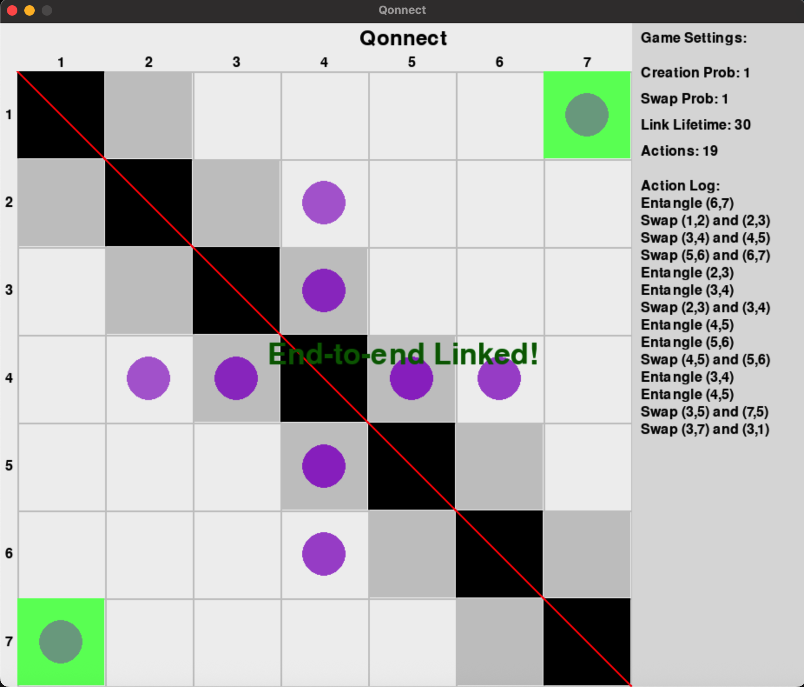

# Qonnect
This is *Qonnect* a simple tabular game that is played according to the rules of quantum repeater networks. The repo can be forked and run locally. The `play.py` file includes the configuration file where the user can change the input parameters. The game was made in the context of my MSc research project [QRL-RL-GNN](https://github.com/chrishalkias/QRN-RN-GNN).

<div align="center">

</div>

# Quick links
Here are some quick links to the following guide:

<div align="center">

ⓘ [Description](#game-description)

📕 [Rules](#game-rules)

🤝 [Entanglement](#entangling)

🔀 [Swapping](#swaping)

🪲 [Bugs](#known-bugs)

🚀 [Instalation](#instalation)
</div>

## Game description
The game consists of an $N$ by $N$ grid in which dots live, the goal of the game is to move a dot to one of the edges of the grid. The grid cells correspond to edges in an underlying graph description (more of that in [physical description](#phys-des))


<a id="phys-des"></a>

## Physical description
Every edge $(i,j)$ is represented as a square in a grid of size $N^2$ and every entanglement is represented with a dot on the associated square. The goal of the game is to have a dot on the square corresponding to the target end-to-end link $(i_A, i_B)$. The two kinds of operations that can be performed (Entanglement and Swaping) are associated with the creation and merging of dots in the game. Importantly since the system is represented by an undirected graph the game has a *discrete reflection symmetry* on the diagonal which turns out to be crucial for playing the game.

Every square is considered to be a repeater that stores qubits. The two permissible operations, outlined in [game rules](#game-rules) correspond to two physical operations. Entanglement generation between two qubits of two repeaters $EG_{i,j}$ such that

$$EG_{i,j} |00\rangle = \frac{1}{\sqrt{2}}\left( |00\rangle + |11 \right)$$

And entanglement swapping, that efectivelly extends the endanglement. If $\rho_{ij}$ and $\rho_{jk}$ are the density matrices of two maximally entangled pairs of qubit repeaters then the swapping operation $S$ does tha following

$$S\left( \rho_{ij}, \rho_{jk} \right) = \rho_{i,j}$$

where $\rho_{ik}$ is again a maximally entangled pair of qubits.

## Game rules
The game has two permissible kinds of operations corresponding to entanglement generation and entanglement swaping
### Entangling:
You can entangle two repeaters if they are adjecent to each other, this would make their corresponding square grey. by clicking on the square one dot is placed there. For a quantum repeater chain the first off diagonal corresponds to the permissible entanglement generation squares, this is because the system is assumed to be a repeater chain. So for a given row or column $i$ the only permissible dot placement positions are
    $$(i,i+1)$$
    $$(i+1, i)$$
## Swaping:
You can choose to perform entanglement swaping by merging two dots into one. To do so select the nodes to be merged and the resulting merged dot will be placed to the corresponding square according to the rules of the swap. These are the following: if two nodes share a repeater then the resulting merged dot will be placed to the square corresponding to the non-shared repeaters. There are 4 possible combinations of merges, these are given below:
    $$(i,j)(j,k) \rightarrow (i,k) \leftarrow (i,j)(k,j)$$
    $$(j,i)(j,k) \rightarrow (i,k) \leftarrow (j,i)(k,j)$$


## Known bugs
A known bug of the game is that the `game_config` needs to be tuned so that the window size is properly displayed.
<!--
add the known bugs
-->

## Instalation

```
git clone https://github.com/chrishalkias/qonnect/
```